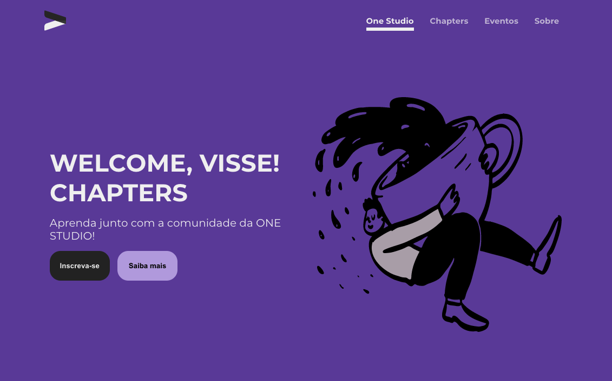

<h1 style="font-family: roboto;" align='center'>Chapter-CSS 💎</h1>

<h1 style="font-family: roboto;" align='center'>
  </img>
  </img>
</h1>

<h1 style="font-family: roboto;" align='center'>
  </img>
</h1>


### :pushpin: Objective

<p style="font-family: roboto;">Project carried out in order to create a layout from scratch, to show how to start development with CSS. In the presentation, the concepts of language in theory and especially in practice were shown.</p>

### :hammer: Requirements

Before you begin, you will need to have the following tools installed on your machine: [VSCode](https://code.visualstudio.com/)

### :rocket: Installing and running

```bash

# Clone the project:
$ git clone https://github.com/Matheus-Rian/Chapter-CSS.git

# Enter the directory:
$ cd Chapter-CSS
  
``` 

### 💜 Figma

<a href="https://www.figma.com/file/HXfPr3ew3tLHOikXz7nFzr/Chapter-Css?node-id=0%3A1">Link of Design🌈</a>

### 📚 Teaching content

<a href="https://docs.google.com/presentation/d/1zE-B-0L0-g_TwhXrgUcvw3Xa79xiTbiUwy-jTAH8asQ/edit?usp=sharing">Link of content📗</a>

### 🏁 Features 

- [X] Interface
#### :construction: More features coming soon ...

### ⚒️ Technology

The following tools were used in the construction of the project:

- [HTML](https://developer.mozilla.org/pt-BR/docs/Web/HTML)
- [CSS](https://developer.mozilla.org/pt-BR/docs/Web/CSS)

---
### :trident: Author 

<a href="https://www.linkedin.com/in/matheus-rian-19b81a183/">
 
 <br />
 <sub><b>Matheus Rian</b></sub></a> <a href="https://www.linkedin.com/in/matheus-rian-19b81a183/" title="MatheusRian">🚀</a>


Made with ❤️ by Matheus Rian :point_right: Get in touch!

[](https://www.linkedin.com/in/matheus-rian-19b81a183/) [](souzamatheusrian@gmail.com)

